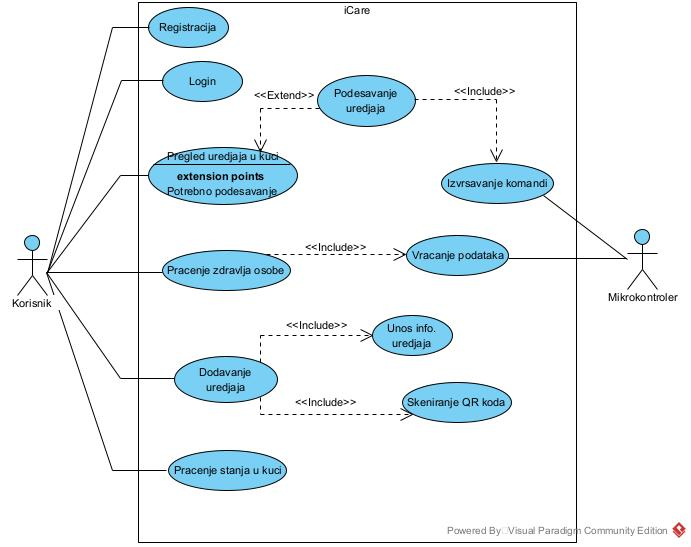

# iCare - pomoć porodicama sa starim i iznemoglim članovima porodice
<br />

## O projektu
Aplikacija se bavi olaksanjem procesa automatizacije pametne kuce s naglaskom na brigu i skrb o dementnim i starim osobama. 

Plan kojim bi se u potpunosti realizovala nasa aplikacija je spajanje mikrokontrolera sa uredjajima i na taj nacin bi se vrsila komunikacija sa istim. U planu je mobilna aplikacija kojom bi se olaksala konekcija na uredjaje skeniranjem QR koda, takodjer, mobilnom aplikacijom bi se olaksala interakcija sa pametnim uređajima. 



<!-- Programi -->
### Programi i programski jezici korišteni za izgradnju aplikacije:
- .NET CORE (C#)
- Flutter (Dart)

<!-- Pokretanje -->
## Pokretanje:
1. Preuzeti projekat sa Github-a
 ```sh
   git clone https://github.com/ensar4/H_repository
   ```
2. Izvršiti komandu "add-migration" u package-manager console i dodati migracije.
```sh
   add-migration
   ```
3. Izvršiti komandu "update-database".
```sh
   update-database
   ```
4. Pokrenuti aplikaciju na backendu u programu Microsoft Visual-Studio.
5. Pokrenuti front-end aplikacije pomoću Visual-Studio Code obavezno preko Chrome pretraživača.
6. Otići na main-dart koji se nalazi u lib folderu te klikom na start u gornjem desnom uglu pokrenuti aplikaciju ili u terminalu komandom "flutter run".
```sh
   flutter run
   ```

<!-- upotreba -->
## Upotreba:
Korisnik nakon pokretanja aplikacije ima mogućnost monitoringa osobe koja se nalazi u njegovom domu kao i većine kućanskih uređaja te upravljanje istim.
Samim pokretanjem aplikacije korisnik ima mogućnost registracije pri čemu je obavezan unijeti neke lične podatke poput imena, prezimena, e-maila, lozinke te naziva kuće i adrese iste. Nakon registracije korisniku je preko logina omogućen pristup svim funkcionalnostima koje aplikacija implementira.
Potrebno je izvršiti dodavanje uređaja kako bi testiranje aplikacije bilo moguće. 
Na početnoj stranici se nalazi brzi pristup i uvid u osnovne funkcionalnosti/informacije. 
Nakon dodavanja uređaja omogućen je odabir uređaja te regulisanje postavki za svaki pojedini uređaj. Naprimjer gašenje, paljenje I upravljanje uređajima.  

<!-- kontakt -->
## Kontakt
Link projekta: https://github.com/ensar4/H_repository
<br />
E-mail developera:
<br />
- ensar.lizde@edu.fit.ba
- maric.lejla@edu.fit.ba
- eldar.sose@edu.fit.ba
